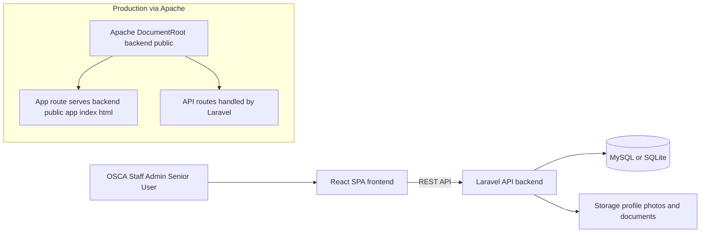
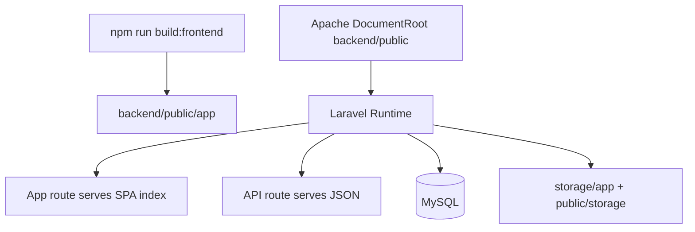

# OSCA Senior Citizen ID System

<p align="center">
  <strong>Operational records, approval workflows, and ID management for OSCA Pagsanjan, Laguna.</strong>
</p>

<p align="center">
  Built with Laravel 12 + React 19 + TypeScript + Vite + Tailwind CSS
</p>

---

## 1. Product Design Intent

The OSCA platform is designed around three goals:

- Reliability: keep citizen records accurate, durable, and auditable.
- Workflow clarity: separate registration, review, approval, and archive lifecycles.
- Operational speed: give staff a fast UI for searches, updates, and reporting.

This repository is a split architecture:

- Backend API and production web entrypoint in `backend/`
- Frontend SPA in `frontend/`
- Root scripts for integrated local startup and Apache deployment build

---

## 2. System Architecture



### Runtime Model

- Development:
  - Vite serves frontend at `http://localhost:3000`
  - Laravel serves API at `http://127.0.0.1:8000`
  - Vite proxy forwards `/api` to Laravel
- Apache/XAMPP deployment:
  - Apache serves Laravel from `backend/public`
  - Built frontend is served from `backend/public/app`
  - `/` redirects to `/app`

---

## 3. Application Architecture

### Backend (Laravel 12)

- Routing:
  - API routes in `backend/routes/api.php`
  - Web routes in `backend/routes/web.php`
- Layers:
  - Controllers in `backend/app/Http/Controllers`
  - Models in `backend/app/Models`
  - Exports/reporting in `backend/app/Exports`
- Cross-cutting concerns:
  - Auth and session/security via Laravel + Sanctum
  - Logging via Laravel logging stack
  - File and public asset handling via `storage` + symlink

### Frontend (React 19 + TS)

- Entry and shell:
  - App root in `frontend/index.tsx` and `frontend/App.tsx`
- Major UI domains in `frontend/components/`:
  - Registry, review, archive, reports, backup, account, dashboard
- Shared state and service boundaries:
  - Auth and app state in `frontend/context/`
  - API interaction in `frontend/services/`
  - Utility logic in `frontend/utils/`

### Data & Identity Model (High-Level)

- Primary actors:
  - Admin
  - Staff
  - Senior user
- Primary business objects:
  - Senior profile
  - Supporting documents and photo assets
  - Approval state/history log entries
  - Generated reports / exports

---

## 4. Repository Map

```text
OSCA/
|-- APP/                      # Windows launcher
|-- backend/                  # Laravel app + API + Apache entrypoint
|   |-- app/
|   |-- config/
|   |-- database/
|   |-- public/
|   `-- routes/
|-- frontend/                 # React application
|   |-- components/
|   |-- context/
|   |-- services/
|   `-- utils/
|-- package.json              # Root task orchestrator
|-- REQUIREMENTS.txt          # Installation checklist
`-- README.md
```

---

## 5. Technology Stack

### Backend

- PHP 8.2+
- Laravel 12
- Laravel Sanctum
- maatwebsite/excel

### Frontend

- React 19
- TypeScript
- Vite 6
- Tailwind CSS
- Axios
- Recharts

### Infrastructure

- XAMPP Apache
- XAMPP MySQL (or SQLite for local lightweight setups)

---

## 6. Local Development Setup

### Prerequisites

- XAMPP (Apache, MySQL, PHP 8.2+)
- Node.js 22 LTS+
- Composer 2.x

Expected PHP extensions:

- `pdo_mysql` or `pdo_sqlite`
- `mbstring`
- `openssl`
- `fileinfo`
- `gd` or `imagick`
- `zip`
- `xml`
- `tokenizer`

### Step 1: Clone project

```bash
git clone https://github.com/PikuFuka/OSCA.git
cd OSCA
```

### Step 2: Install root tools

```bash
npm install
```

### Step 3: Backend install + env

```bash
cd backend
composer install
copy .env.example .env
php artisan key:generate
```

On macOS/Linux: `cp .env.example .env`

### Step 4: Configure database in `backend/.env`

MySQL option:

```dotenv
DB_CONNECTION=mysql
DB_HOST=127.0.0.1
DB_PORT=3306
DB_DATABASE=osca_db
DB_USERNAME=root
DB_PASSWORD=
```

SQLite option:

```dotenv
DB_CONNECTION=sqlite
```

For SQLite, create an empty file at `backend/database/database.sqlite`.

### Step 5: Migrate and link storage

```bash
php artisan migrate
php artisan storage:link
php artisan db:seed
```

`db:seed` is optional.

### Step 6: Frontend install

```bash
cd ..\frontend
npm install
```

### Step 7: Run in development mode

```bash
cd ..
npm run dev
```

This starts:

- MySQL via hardcoded path `C:\xampp\mysql\bin\mysqld.exe`
- Laravel at `http://127.0.0.1:8000`
- Vite at `http://localhost:3000`

Development URLs:

- Frontend: `http://localhost:3000`
- API: `http://127.0.0.1:8000/api`
- phpMyAdmin: `http://localhost/phpmyadmin`

---

## 7. Deployment Architecture (Apache/XAMPP)

This is the recommended deployment path for LAN office usage.

### Deployment Topology



### Step-by-Step Deployment

1. Configure environment in `backend/.env`:

```dotenv
APP_ENV=production
APP_DEBUG=false
APP_URL=http://YOUR_HOST_OR_IP
```

2. Install root and backend dependencies:

```bash
npm install
cd backend
composer install --no-dev --optimize-autoloader
php artisan migrate --force
php artisan storage:link
```

3. Build frontend for production:

```bash
cd ..
npm run build:frontend
```

4. Set Apache `DocumentRoot` to:

```text
.../OSCA/backend/public
```

5. Optionally start from sample config:

- `backend/deploy/xampp-vhost.conf.example`

6. Restart Apache and verify:

- `/` redirects to `/app`
- `/app` serves the built SPA
- `/api/*` serves Laravel API routes

7. For LAN access:

- Allow Apache in Windows Firewall
- Access with machine IP, e.g. `http://192.168.x.x/app`
- Keep `APP_URL` aligned with actual access host/IP

### Frontend Update Rule

Every frontend code change requires rebuilding:

```bash
npm run build:frontend
```

---

## 8. Security & Operations Notes

- Change seeded/default credentials immediately in non-dev environments.
- Keep `APP_DEBUG=false` in deployed environments.
- Do not regenerate `APP_KEY` on a live environment unless planned.
- Run regular database backups and validate restore procedures.
- Restrict server access to trusted network segments where possible.

---

## 9. Commands Reference

### Root

```bash
npm run dev
npm run build:frontend
npm run deploy:apache
```

### Backend

```bash
cd backend
php artisan serve
php artisan migrate
php artisan db:seed
php artisan test
```

### Frontend

```bash
cd frontend
npm run dev
npm run build
npm run preview
```

---

## 10. Seeded Accounts (If `db:seed` is used)

- Admin email: `admin@osca.gov.ph`
- Admin password: `admin123`
- Staff email: `staff@osca.gov.ph`
- Staff password: `staff123`

Change these immediately after deployment.

---

## 11. Troubleshooting

### `composer` not recognized

Install Composer and ensure Composer bin directory is in `PATH`.

### `php` not recognized

Add XAMPP PHP path (usually `C:\xampp\php`) to system `PATH`.

### `/app` returns 503

Frontend production assets are missing. Rebuild:

```bash
npm run build:frontend
```

### Uploaded files not visible

Ensure storage symlink exists:

```bash
cd backend
php artisan storage:link
```

### CORS issues in dev mode

Use frontend at port 3000 and backend at 8000 to match configured proxy/CORS.

---

## 12. Maintainer Notes

- This root README is the canonical setup + architecture + deployment document.
- `backend/README.md` and `frontend/README.md` are framework boilerplate defaults.

Last updated: March 22, 2026