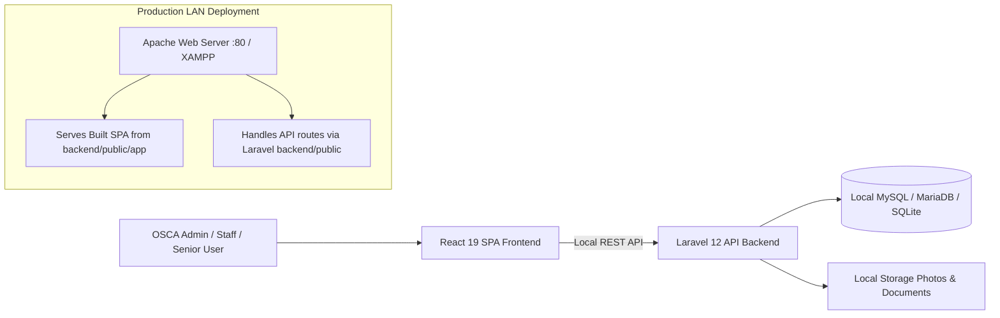

# OSCA Senior Citizen ID & Management System

<p align="center">
  <strong>Operational records, approval workflows, digital ID design, batch printing, and demographic reporting for OSCA Pagsanjan, Laguna.</strong>
</p>

<p align="center">
  Built with Laravel 12 &bull; React 19 &bull; TypeScript &bull; Vite 6 &bull; Tailwind CSS &bull; MySQL / SQLite
</p>

---

## Table of Contents

1. [Product Overview & Key Features](#1-product-overview--key-features)
2. [Architecture & Runtime Model](#2-architecture--runtime-model)
3. [System Requirements & Prerequisites](#3-system-requirements--prerequisites)
4. [Fresh Local Development Setup](#4-fresh-local-development-setup)
5. [Transferring the System to Other Devices](#5-transferring-the-system-to-other-devices)
   - [Method A: Transfer via USB Flash Drive / ZIP (Offline / Air-Gapped)](#method-a-transfer-via-usb-flash-drive--zip-offline--air-gapped)
   - [Method B: Transfer via Git Repository](#method-b-transfer-via-git-repository)
   - [Migrating Existing Database & Uploaded Citizen Files](#migrating-existing-database--uploaded-citizen-files)
6. [Production Deployment via Apache / XAMPP (Office LAN)](#6-production-deployment-via-apache--xampp-office-lan)
7. [100% Offline Operation Architecture](#7-100-offline-operation-architecture)
8. [Seeded Accounts & Roles](#8-seeded-accounts--roles)
9. [Available CLI Commands](#9-available-cli-commands)
10. [Troubleshooting & FAQ](#10-troubleshooting--faq)

---

## 1. Product Overview & Key Features

* **Member Registry**: Real-time searchable database of senior citizens with instant filters by 16 barangays, pension status, age brackets, and verification state.
* **Dual-Sided Digital ID Studio**: Interactive card builder with customizable drag-and-drop labels, QR code generation, front/back preview, and multi-card batch printing.
* **Smart Camera with AI Background Removal**: Live camera capture with client-side AI selfie segmentation (`@mediapipe`), 100% self-hosted with zero internet connection required.
* **Application Approval Workflow**: Review and manage pending registrations, document submissions, and profile change requests before committing to the official registry.
* **Audited Reporting & Excel Exports**: One-click generation of audited masterlists, centenarians roster, deceased records, and newly registered seniors.
* **Account Management & RBAC**: Role-based access control for Admins, Staff, and Senior Citizen self-service portal accounts.
* **Automated Audit Logs & Backups**: Audit trail for every record change, ID print, or deletion, retained 90 days by default (`AUDIT_LOG_RETENTION_DAYS` in `backend/.env`, `0` keeps everything). Manual clearing always leaves a `CLEARED_LOGS` tombstone. Database export/import tools included; every import takes a restorable pre-import snapshot first.

---

## 2. Architecture & Runtime Model


```mermaid
flowchart LR
  U[OSCA Admin / Staff / Senior User] --> FE[React 19 SPA Frontend]
  FE -->|Local REST API| BE[Laravel 12 API Backend]
  BE --> DB[(Local MySQL / MariaDB / SQLite)]
  BE --> FS[Local Storage Photos & Documents]

  subgraph Production LAN Deployment
    AP[Apache Web Server :80 / XAMPP]
    AP --> SPA[Serves Built SPA from backend/public/app]
    AP --> API[Handles API routes via Laravel backend/public]
  end
```

### Runtime Modes:
* **Development Mode**:
  * Frontend Vite Dev Server runs at `http://localhost:3000` (or `3001` if busy).
  * Backend Laravel API runs at `http://127.0.0.1:8000`.
  * Vite proxy automatically routes `/api` calls to Laravel.
* **Production / Apache Mode**:
  * Apache serves the compiled single-page application from `backend/public/app`.
  * Root URL (`/`) automatically redirects to `/app`.
  * Accessible by other computers across the local office network via LAN IP (e.g. `http://192.168.1.50/app`).

---

## 3. System Requirements & Prerequisites

### Minimum Hardware:
* **Processor**: Intel Core i3 / AMD Ryzen 3 or higher
* **RAM**: 4 GB minimum (8 GB recommended)
* **Storage**: 2 GB free disk space

### Software:
1. **Operating System**: Windows 10 / 11, macOS, or Linux
2. **XAMPP**: Version 8.2 or higher (includes Apache, MySQL/MariaDB, PHP 8.2+)
   * [Download XAMPP](https://www.apachefriends.org/download.html)
3. **Node.js**: Version 18 LTS, 20 LTS, or 22+ (includes npm)
   * [Download Node.js](https://nodejs.org/)
4. **Composer**: Version 2.x (PHP Dependency Manager)
   * [Download Composer](https://getcomposer.org/download/)
5. **Git** (Optional for Git-based deployment):
   * [Download Git](https://git-scm.com/downloads)

### Required PHP Extensions in `php.ini`:
Ensure these are enabled in your XAMPP `php.ini` (remove the leading `;` if commented):
```ini
extension=pdo_mysql
extension=pdo_sqlite
extension=mbstring
extension=openssl
extension=fileinfo
extension=gd
extension=zip
extension=xml
extension=curl
```

---

## 4. Fresh Local Development Setup

Follow these steps when setting up the project for the first time from Git:

### Step 1: Clone Repository
```bash
git clone https://github.com/PikuFuka/OSCA.git
cd OSCA
```

### Step 2: Install Root Dependencies
```bash
npm install
```

### Step 3: Setup Backend Environment
```bash
cd backend
composer install
copy .env.example .env
php artisan key:generate
```
*(On macOS / Linux, use `cp .env.example .env`)*

### Step 4: Configure Database in `backend/.env`
Open `backend/.env` in any text editor and configure your database settings:

**Option A — MySQL (Default with XAMPP):**
1. Start **Apache** and **MySQL** in the XAMPP Control Panel.
2. Open `http://localhost/phpmyadmin` and create a database named `osca_db`.
3. In `backend/.env`:
```dotenv
DB_CONNECTION=mysql
DB_HOST=127.0.0.1
DB_PORT=3306
DB_DATABASE=osca_db
DB_USERNAME=root
DB_PASSWORD=
```

**Option B — SQLite (Zero setup database file):**
1. In `backend/.env`:
```dotenv
DB_CONNECTION=sqlite
```
2. Create an empty file at `backend/database/database.sqlite`.

### Step 5: Run Migrations, Seeds & Link Storage
```bash
php artisan migrate --seed
php artisan storage:link
```

### Step 6: Setup Frontend
```bash
cd ../frontend
npm install
```

### Step 7: Launch System
From the root `OSCA` directory:
```bash
cd ..
npm run dev
```

Open your browser at: **`http://localhost:3000`**

---

## 5. Transferring the System to Other Devices

When transferring the system to another office PC, laptop, or server, follow one of the two methods below.

---

### Method A: Transfer via USB Flash Drive / ZIP (Offline / Air-Gapped)

Use this method when moving the system to a computer that has limited or no internet connection.

#### Step 1: Clean Up Source Project on the Old Device
Before copying the project to a USB flash drive, remove transient build folders to save gigabytes of space and prevent symlink corruption:

Run in PowerShell or Command Prompt from the project root:
```bash
# Remove node_modules and vendor (they will be reinstalled or transferred cleanly)
rd /s /q node_modules
rd /s /q frontend\node_modules
rd /s /q backend\vendor

# Remove compiled dist and storage symlink
rd /s /q frontend\dist
rd /s /q backend\public\storage
```

#### Step 2: Export Database & Copy Uploaded Citizen Files
1. **Export Database**:
   * Open `http://localhost/phpmyadmin` &rarr; click `osca_db` &rarr; click **Export** &rarr; click **Export** (saves `osca_db.sql`).
   * *Or use the in-app backup view at `http://localhost:3000` &rarr; System Logs &rarr; Backup &rarr; Export Database.*
   * Place `osca_db.sql` into the project root folder.
2. **Citizen Photos & Files**:
   * Ensure `backend/storage/app/public/` is copied intact (this folder holds uploaded ID photos and verification documents).

#### Step 3: Copy Folder to New Device
Copy the entire `OSCA/` folder to the target computer (e.g. `C:\Users\<YourUsername>\Desktop\OSCA` or `C:\xampp\htdocs\OSCA`).

#### Step 4: Install & Initialize on the New Device
On the new computer (make sure XAMPP, Node.js, and Composer are installed):

1. **Start XAMPP MySQL & Apache** in XAMPP Control Panel.
2. **Create Database & Import SQL**:
   * Open `http://localhost/phpmyadmin` &rarr; Create database `osca_db`.
   * Click **Import** &rarr; choose `osca_db.sql` &rarr; click **Import**.
3. **Open Terminal in `OSCA/backend`**:
   ```bash
   cd backend
   composer install
   copy .env.example .env
   php artisan key:generate
   php artisan migrate
   php artisan storage:link
   ```
4. **Open Terminal in `OSCA/frontend`**:
   ```bash
   cd ../frontend
   npm install
   npm run build
   ```
5. **Start System**:
   ```bash
   cd ..
   npm run dev
   ```

---

### Method B: Transfer via Git Repository

Use this method if both machines have internet access or are on the same local Git server.

#### On the Source Device:
1. Commit and push any recent code changes:
   ```bash
   git add .
   git commit -m "Update OSCA system"
   git push origin main
   ```
2. Export your latest database from `http://localhost/phpmyadmin` or via MySQL CLI:
   ```bash
   mysqldump -u root osca_db > osca_backup.sql
   ```
3. Copy `osca_backup.sql` and the contents of `backend/storage/app/public` to a USB drive or cloud drive.

#### On the Target Device:
1. Clone the repository:
   ```bash
   git clone https://github.com/PikuFuka/OSCA.git
   cd OSCA
   ```
2. Install dependencies:
   ```bash
   npm install
   cd backend && composer install
   cd ../frontend && npm install
   ```
3. Setup `.env` and generate key:
   ```bash
   cd ../backend
   copy .env.example .env
   php artisan key:generate
   ```
4. Import database:
   * Create `osca_db` in phpMyAdmin.
   * Import `osca_backup.sql`.
5. Restore citizen uploaded files:
   * Paste the copied files into `backend/storage/app/public/`.
   * Run `php artisan storage:link`.
6. Run the application:
   ```bash
   cd ..
   npm run dev
   ```

---

### Migrating Existing Database & Uploaded Citizen Files

Whenever moving live senior records between machines:

| Item | Source Location | Destination Location | How to Migrate |
| :--- | :--- | :--- | :--- |
| **Database Data** | MySQL `osca_db` | MySQL `osca_db` | Export `.sql` from phpMyAdmin on old PC, Import into phpMyAdmin on new PC. |
| **Profile Photos & Documents** | `backend/storage/app/public/` | `backend/storage/app/public/` | Copy folder contents, then run `php artisan storage:link` in `backend/`. |
| **System Environment** | `backend/.env` | `backend/.env` | Copy DB credentials, verify `APP_KEY` matches if encrypted tokens are used. |

---

## 6. Production Deployment via Apache / XAMPP (Office LAN)

To run the system as a permanent office service accessible by multiple computers over LAN:

### Step 1: Build the Production Frontend
From the root directory:
```bash
npm run build:frontend
```
This compiles the React app directly into `backend/public/app`.

### Step 2: Configure `backend/.env` for Production
```dotenv
APP_ENV=production
APP_DEBUG=false
APP_URL=http://YOUR_SERVER_LAN_IP
```
*(Example: `APP_URL=http://192.168.1.100`)*

### Step 3: Configure Apache DocumentRoot in XAMPP
Open `C:\xampp\apache\conf\extra\httpd-vhosts.conf` and add:
```apache
<VirtualHost *:80>
    ServerName osca.local
    DocumentRoot "C:/xampp/htdocs/OSCA/backend/public"
    <Directory "C:/xampp/htdocs/OSCA/backend/public">
        Options Indexes FollowSymLinks
        AllowOverride All
        Require all granted
    </Directory>
</VirtualHost>
```

### Step 4: Restart Apache & Open Firewall
1. Restart Apache in the XAMPP Control Panel.
2. In Windows Firewall &rarr; Allow an app &rarr; Allow Apache HTTP Server on Private Network.
3. Access the system from any device on the network:
   * From server: `http://localhost/app`
   * From other PCs: `http://192.168.1.100/app`

---

## 7. 100% Offline Operation Architecture

The OSCA system is specifically architected to work in **100% air-gapped environments with zero active internet connection**:

* **Self-Hosted AI Camera**: MediaPipe selfie segmentation models (`.tflite`), SIMD binaries, and WASM files are bundled locally under `/frontend/public/mediapipe/selfie_segmentation/`. No CDN downloads are required.
* **Self-Hosted Typography**: Inter font files are bundled into the app distribution (`.woff2`). No Google Fonts network requests are made.
* **Local Compute & Storage**: All PDF printing, canvas rendering, Excel document generation, and database queries run entirely on the host machine.

---

## 8. Seeded Accounts & Roles

When running `php artisan db:seed`, the following accounts are initialized:

| Role | Email / Identifier | Password | Permissions |
| :--- | :--- | :--- | :--- |
| **Administrator** | `admin@osca.gov.ph` | `admin123` | Full access (Registry, Approvals, Accounts, System Logs, Database Backup) |
| **Staff Member** | `staff@osca.gov.ph` | `staff123` | Operations (Registry, Approvals, Registration, Batch Print, Reports) |
| **Senior Citizen** | OSCA ID (e.g. `24-0001`) | Set upon registration | Personal Portal (View Status, Digital ID Review, Update Request) |

> **Important**: Change default administrator and staff passwords immediately after deployment in production.

---

## 9. Available CLI Commands

### Root Workspace Commands
```bash
npm run dev              # Starts MySQL + Laravel API + Vite Dev Server concurrently
npm run build:frontend   # Compiles frontend SPA into backend/public/app for Apache
npm run deploy:apache    # Full production build and setup for Apache
```

### Backend Commands (`cd backend`)
```bash
php artisan serve        # Runs local Laravel dev server at 127.0.0.1:8000
php artisan migrate      # Runs database migrations
php artisan db:seed      # Seeds default admin and staff accounts
php artisan storage:link # Creates public symlink for uploaded citizen documents
php artisan test         # Runs automated PHPUnit backend tests
```

### Frontend Commands (`cd frontend`)
```bash
npm run dev              # Starts Vite dev server at http://localhost:3000
npm run build            # Builds production assets to ../backend/public/app
npm run test             # Runs Vitest unit tests
```

---

## 10. Troubleshooting & FAQ

### 1. `php` or `composer` is not recognized
* Ensure `C:\xampp\php` is added to your Windows Environment `PATH` variable.
* Ensure Composer bin directory (usually `C:\ProgramData\ComposerSetup\bin`) is in `PATH`.

### 2. Uploaded photos or documents return 404 / broken image
* The storage symlink is missing. Open terminal in `backend/` and run:
  ```bash
  php artisan storage:link
  ```

### 3. Database connection refused (`SQLSTATE[HY000] [2002]`)
* Make sure MySQL is running in the XAMPP Control Panel.
* Verify port `3306` and credentials in `backend/.env`.

### 4. Port 3000 is already in use
* Vite will automatically assign port `3001` or `3002`. You can also close the competing application or specify a custom port in `frontend/vite.config.ts`.

### 5. Apache returns 503 / 404 on `/app`
* The frontend production bundle has not been built yet. Run from project root:
  ```bash
  npm run build:frontend
  ```

---

*OSCA Senior Citizen ID System &bull; Municipal Government of Pagsanjan, Laguna &bull; Developed for reliable offline governance.*